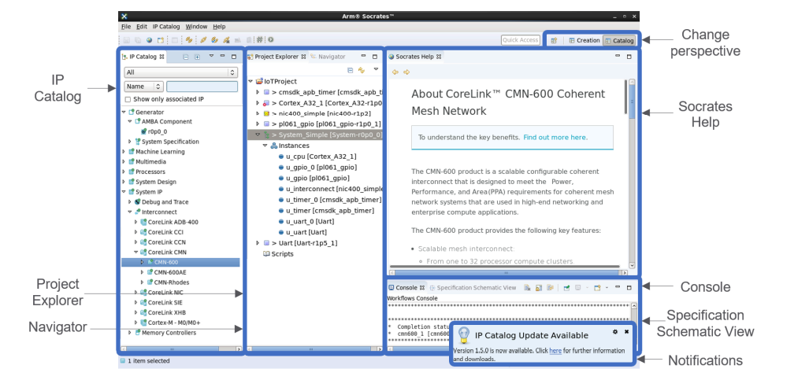
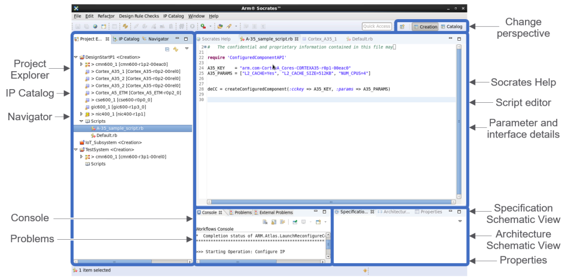

Socrates™ has several panels, known as views, arranged into two perspectives.
You can rearrange the panels to suit the way you work. To reset the default layouts, select
**Window > Perspective > Reset perspective... .**

The following figures show the default layout of views in Socrates, after you close the Welcome
page

| Name | Description
|------| ----|
| Change perspective | Switch between **Catalog** and **Creation** layouts |
| IP Catalog | A hierarchical list of all the supported Arm IP products and versions. You can filter the list by group, name, protocol, or valid associations. See https://developer.arm.com/documentation/101399/010900?lang=en |
| Project Explorer | Projects and configured IP https://developer.arm.com/documentation/101399/010900?lang=en |
| Navigator | File system view of projects |
| Socrates Help | Detailed information about the selected IP|
| Script Editor | Use to edit scripts |
| Paramater and interface details | Double-click an IP entry in the **Project Explorer** to see information about configuration and interfaces |
| Properties | Shows properties of the selected IP |
| Notifications | Shows when updates are available for the product IP catalog |

---------------
Note: Socrates is built on Eclipse®, and not all of the Eclipse functionality is used or
supported by Socrates. Therefore, if the functionality is not described in the
Socrates documentation it might have unexpected behavior. For example, Socrates
does not support the **Add project to working sets** option in the **File > Import > General > Existing Projects into Workspace window**.

-----------------------
